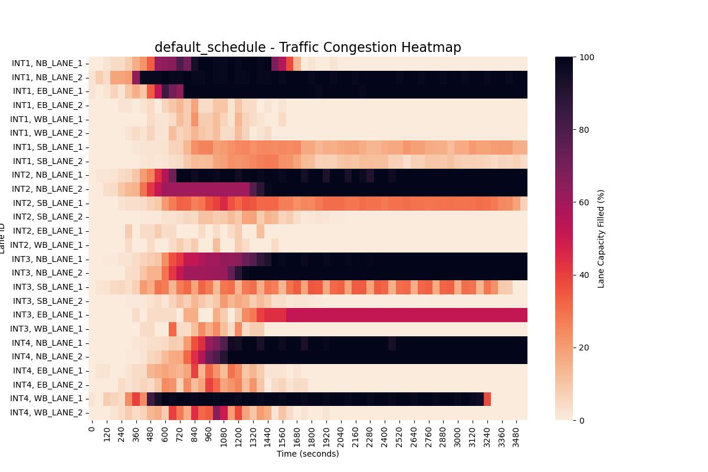
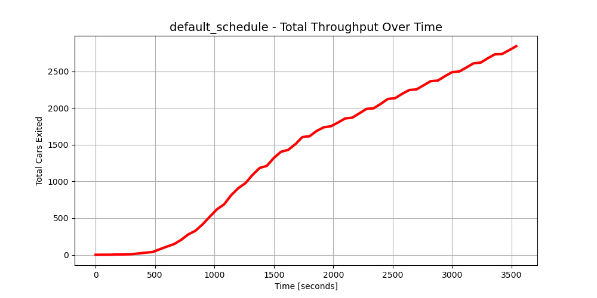
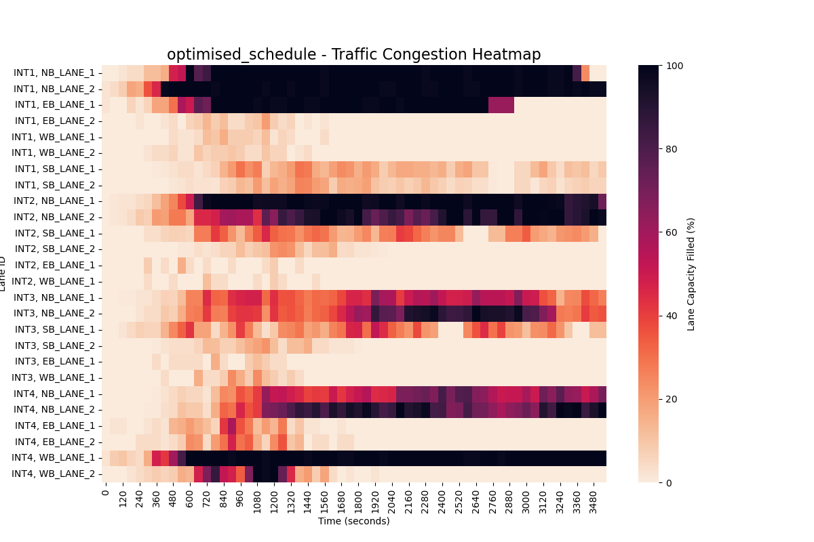
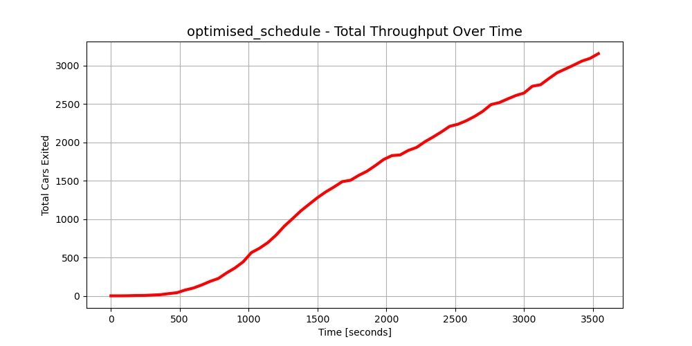

# **Traffic Flow Simulation & Optimisation**

## **WIP**

A discrete time traffic optimisation framework utilising Logic-Based Benders' Decomposition. Integrates a Gurobi Master Problem for traffic light schedule generation with a custom simulation Subproblem, using iterative callbacks to find an optimal traffic light schedule.

### **Problem Description:**
The goal of this project is to build a "soft digital twin" of a traffic corridor and use mathematical optimisation to find a better traffic light schedule than a standard, static alternating pattern.

The problem is modeled around a specific gridlock scenario with the following parameters:

- The Network: 3 cross-road intersections (INT1, INT2 and INT3) and 1 T-junction (INT4), all connected via a main arterial road (INT1 connects to INT2 connects to INT3 connects to INT4).
- The Time Horizon: A 1-hour continuous simulation (3,600 discrete seconds).
- The Demand: 5,000 vehicles spawn into the network over the hour.
- The Gridlock: To stress-test the network, vehicle spawn rates are intentionally asymmetric. The majority of the traffic is funneled through only a couple of intersection lanes, which generates a severe gridlock across the map.
- The Baseline: A default static alternating light schedule (e.g., 45s ON / 45s OFF, and 30s ON / 30s OFF) struggles to handle the uneven demand, generating a total network throughput of only 2,845 cars.

The Objective: Formulate this environment as a Mixed-Integer Programming (MIP) problem to find a custom schedule that breaks the gridlock and increases vehicle throughput compared to the baseline.

### **Simulation:**
To test and score the traffic light schedules, I built a custom Stochastic Cellular Automata engine in Python to act as the environment's "Digital Twin".

The simulation physically tracks individual vehicles across the network using the following logic:

- Discrete Grid & Time: The road network is divided into individual cells, and the simulation steps forward second-by-second for the full 3,600-second horizon.
- State-Based Movement: Vehicles traverse the grid using strict cellular automata rules. During each 1-second step, a car checks the state of the cell directly ahead. It advances if the next cell is unoccupied or waits if blocked by a red phase or another vehicle. This finite-capacity design ensures that bottlenecks naturally cause cascading queues across the entire network.
- Merging: If a vehicle needs to merge to reach its destination, it checks the adjacent cell. If unoccupied, it shifts over; if blocked, it proceeds forward. If a car reaches the front of its lane and still needs to merge, it halts and waits for an opening - escalating the grid-lock.
- Stochastic Spawning: Rather than feeding a steady, manageable stream of traffic, vehicle arrival times are modeled using a clipped Normal distribution ($\mu = 15$ mins, $\sigma = 5$ mins). This forces the majority of the 5,000 vehicles to spawn in a massive, highly concentrated "rush hour" wave early in the simulation. This intentionally overloads the network's physical capacity, stress-testing the optimised schedule's ability to clear a severe backlog before the 1-hour limit is reached.
- The Evaluator: The simulation serves as the "Subproblem" or scoring mechanism. You feed it a specific traffic light schedule, and it runs all 5,000 cars through the grid physics to output a final score: the exact number of cars that successfully exited the map.

### **Optimisation:**
The core optimisation engine utilises a Logic-Based Benders Decomposition (LBBD) architecture to integrate a Gurobi mathematical solver directly with the stochastic traffic simulation.

**Mathematical Formulation (Overview):**
The Master Problem is formulated as a Mixed-Integer Linear Program (MILP) which is responsible for constructing the traffic light schedule, with over 32,400 binary decision variables representing the state of every traffic phase at every second. 

The solver navigates the following core logical constraints:

- Incompatibility Constraints: Ensures mutually exclusive traffic movements (e.g., at Intersection 1, North-South traffic cannot have a green light while East-West traffic is moving).
- Continuous Operation: Ensures that exactly 1 phase must be active at all times at each intersection for the majority of the simulation. The last 90 seconds are relaxed meaning that both phases can be set to "off" to help with finding feasible schedules.
- Phase Duration Limits: Ensures every green light meets a minimum safe duration (20 seconds) and does not exceed a maximum limit (90 seconds).
- End-of-Simulation Boundary: Prevents a phase from turning green near the very end of the simulation if there is not enough time remaining to physically satisfy the minimum 20-second green light duration.

**Lazy Constraints:** 
- Optimiality cut (Hamming Distance): When the simulation evaluates a schedule as poor, the callback applies a Hamming distance cut to the Master Problem. This restricts the solver's objective bound, mathematically forcing it to explore significantly different binary sequences rather than making minor adjustments to a failed schedule.
- Feasiblity cut (Congestion Feedback): The callback actively monitors lane capacities during the simulation. If a lane exceeds 75% capacity, it identifies a severe bottleneck and dynamically injects a feasibility cut. This forces the solver to increase the minimum green time for that specific phase by 2.5% in all future iterations, ensuring the model actively adapts to clear the congestion.

### **Results:**
The custom solver successfully generated a schedule that noticeably improves network throughput over the static baseline.

With the default schedule (fixed 45s/30s rotations), the network struggles to handle the asymmetric rush-hour demand. Severe bottlenecks form and quickly spill backward, locking up the grid and restricting the final throughput to just 2,845 vehicles out of the 5,000 spawned.

By using the congestion feedback from the simulation callbacks, the optimisation engine learned to reallocate green time to the heaviest bottlenecks. This prevented the upstream spillback and kept the network flowing, resulting in a final throughput of 3,187 vehicles. This is a 12% increase over the baseline, clearing an extra 342 cars within the exact same 1-hour limit.

**Early Termination (Speed vs. Optimality):*** Rather than running the solver for days to prove a global mathematical optimum, the engine is configured to prioritize computational efficiency. The callback is set to automatically terminate the run the moment it evaluates any schedule that improves throughput by at least 10% over the baseline (2845 cars). The 3,187 score (+12%) triggered this early stopping condition, delivering a highly effective schedule in a fraction of the time.

The visualisations below compare the two runs, showing the reduction in localised gridlock (Heatmaps) and the improved exit rate over time (Throughput).

#### Default Schedule:

#### Optimal Schedule (10% increase in throughput):

### Conclusion:
This project demonstrates how mathematical optimisation can be used to solve infrastructure challenges that standard timing patterns cannot. The framework successfully navigated the asymmetric demand and high-density surges that caused the baseline gridlock. By integrating a Gurobi Master Problem with a simulation Subproblem, the system identified a schedule that increased network throughput by 12%, effectively breaking the gridlock and proving the value of custom, logic-based signal timing in complex urban environments.

### **TO-DO:**
* find better solutions