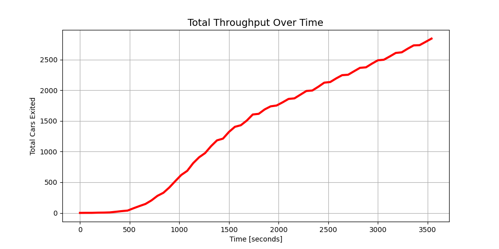

# Traffic-Simulation

## WORK IN PROGRESS

A discrete time traffic optimisation framework utilising Logic-Based Benders Decomposition. Integrates a Gurobi Master Problem for traffic light schedule generation with a custom simulation Subproblem, using iterative callbacks to converge on optimal traffic light schedule.

TO-DO:
* find better solutions

### Default Schedule

### Optimal Schedule (10% increase in throughput)

